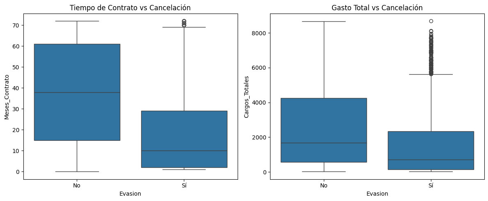

# 📊 Telecom X — Predicción de Cancelación de Clientes (Churn)

Este proyecto analiza el comportamiento de los clientes de **Telecom X** con el objetivo de identificar los factores que influyen en la cancelación del servicio (evasión o churn) y construir modelos capaces de predecir qué clientes tienen mayor probabilidad de abandonar la empresa.

El análisis combina exploración de datos, modelado predictivo y análisis de variables para transformar datos en información útil para la toma de decisiones estratégicas.

---

# 📑 Índice

- [📊 Telecom X — Predicción de Cancelación de Clientes](#-telecom-x--predicción-de-cancelación-de-clientes-churn)
- [🎯 Objetivos del Proyecto](#-objetivos-del-proyecto)
- [⚙️ Tecnologías Utilizadas](#️-tecnologías-utilizadas)
- [📑 Preparación de los Datos](#-preparación-de-los-datos)
- [📊 Análisis Exploratorio de Datos](#-análisis-exploratorio-de-datos)
- [🤖 Modelos Predictivo](#-modelos-predictivo)
- [📈 Evaluación de Modelos](#-evaluación-de-modelos)
- [🔍 Factores que Influyen en la Cancelación](#-factores-que-influyen-en-la-cancelación)
- [💡 Estrategias de Retención](#-estrategias-de-retención)
- [🧠 Conclusión](#-conclusión)
- [👨‍💻 Autor](#-autor)
- [🤝 Colaboración](#-colaboración)
- [🌐 Conecta conmigo](#-conecta-conmigo)

---

# 🎯 Objetivos del Proyecto

El proyecto tiene como objetivos principales:

- Preparar y limpiar los datos para el análisis.
- Analizar la distribución y correlación de las variables.
- Identificar los factores que influyen en la cancelación de clientes.
- Construir modelos de Machine Learning para predecir el churn.
- Evaluar el rendimiento de los modelos.
- Proponer estrategias de retención basadas en los resultados obtenidos.

---

# ⚙️ Tecnologías Utilizadas

Este proyecto fue desarrollado utilizando herramientas comunes en Data Science y Machine Learning:

- Python  
- Pandas  
- NumPy  
- Matplotlib  
- Seaborn  
- Scikit-learn  

Estas herramientas permitieron realizar procesamiento de datos, visualización y modelado predictivo.

---

# 📑 Preparación de los Datos

Antes de entrenar los modelos fue necesario realizar un proceso de preparación de datos, que incluyó:

- Eliminación de columnas irrelevantes  
- Codificación de variables categóricas  
- Normalización de variables numéricas  
- Verificación de la distribución de la variable objetivo  

Durante este proceso se observó que aproximadamente:

- **73% de los clientes permanecen activos**  
- **27% de los clientes cancelan el servicio**

Esto indica un desbalance moderado en los datos, lo cual fue considerado durante el entrenamiento de los modelos para evitar sesgos en las predicciones.

---

# 📊 Análisis Exploratorio de Datos

Se realizó un análisis exploratorio para comprender mejor el comportamiento de los clientes y detectar patrones relevantes.

### Distribución de Cancelación de Clientes

Este análisis permitió identificar diferencias importantes entre los clientes que permanecen en la empresa y aquellos que cancelan el servicio.

---

# 🤖 Modelos  Predictivo

Para predecir la cancelación de clientes se implementaron modelos, los cuales permiten identificar patrones en los datos y estimar la probabilidad de abandono.

Entre los modelos utilizados se encuentran:

- Regresión Logística
- Random Forest

Estos algoritmos son ampliamente utilizados en problemas de clasificación debido a su capacidad para analizar relaciones entre variables y generar predicciones confiables.

Los modelos fueron entrenados utilizando un conjunto de datos de entrenamiento y posteriormente evaluados con datos de prueba, permitiendo medir su capacidad para identificar correctamente a los clientes con mayor riesgo de cancelación.

---

# 📈 Evaluación de Modelos

Para evaluar el desempeño de los modelos se utilizaron diversas métricas de clasificación:

- Accuracy
- Precision
- Recall
- F1-Score
- Matriz de Confusión

Estas métricas permiten analizar qué tan bien el modelo logra identificar correctamente a los clientes que cancelan el servicio.

Los resultados obtenidos muestran que los modelos alcanzan una precisión aproximada entre:

**74% – 78% de exactitud**

Esto indica un buen desempeño para la predicción de cancelación de clientes, considerando la complejidad del comportamiento del usuario.

---

# 🔍 Factores que Influyen en la Cancelación

A partir del análisis de los modelos y la importancia de variables, se identificaron algunos factores clave que influyen en la cancelación de clientes:

- Cargos Totales del Servicio
- Cargos Mensuales
- Duración del Contrato
- Tipo de Contrato
- Tipo de Servicio de Internet
- Cantidad de servicios adicionales contratados

---

# 💡 Estrategias de Retención

Con base en los resultados obtenidos, se pueden proponer diversas estrategias para reducir la cancelación de clientes:

- Incentivar contratos de largo plazo
- Optimizar los planes de precios
- Mejorar la experiencia del servicio de internet
- Implementar modelos predictivos para identificar clientes en riesgo

El uso de analítica predictiva permite a las empresas actuar de manera preventiva y mejorar la retención de clientes.

---

# 🧠 Conclusión

Este proyecto demuestra cómo el análisis de datos y las técnicas pueden utilizarse para comprender el comportamiento de los clientes y anticipar la cancelación del servicio.

Los resultados muestran que factores relacionados con costos del servicio, duración del contrato y características del plan contratado influyen significativamente en la decisión de los clientes de abandonar la empresa.

La implementación de modelos predictivos permite a las empresas identificar clientes con alto riesgo de cancelación y aplicar estrategias de retención de forma proactiva, mejorando la toma de decisiones basada en datos.

---

# 👨‍💻 Autor

Anayely Reyes

---

# 🤝 Colaboración

Proyecto desarrollado en colaboración con el programa educativo de:

**Alura Latam**

---

